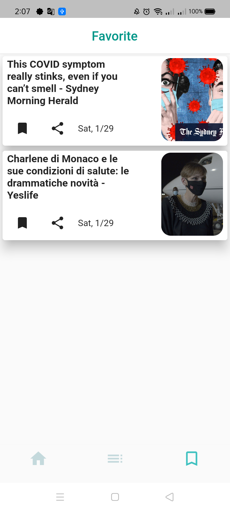

  
  
  
  # NewsNow
  
Local and international news in various fields: Follow Egypt news, world news, art news, sports news, economy news, health news and others in one place from more than one source around the world. Breaking news around the clock

Apis : https://newsapi.org/

## Endpoints

- [Everything](https://newsapi.org/docs/endpoints/everything)

- Search through millions of articles from over 80,000 large and small news sources and blogs.

- [Top headlines](https://newsapi.org/docs/endpoints/top-headlines)

- This endpoint provides live top and breaking headlines for a country, specific category in a country, single source, or multiple sources. You can also search with keywords. Articles are sorted by the earliest date published first.

- [Sources](https://newsapi.org/docs/endpoints/sources)

  This endpoint returns the subset of news publishers that top headlines 

# Package

## cached_network_image:  A flutter library to show images from the internet and keep them in the cache directory.

## http : A composable, Future-based library for making HTTP requests

## intl : Provides internationalization and localization facilities, including message translation, plurals and genders, date/number formatting and parsing, and bidirectional text.

## flutter_riverpod : A state-management library that:

- catches programming errors at compile time rather than at runtime
- removes nesting for listening/combining objects
- ensures that the code is testable

## share_plus : A Flutter plugin to share content from your Flutter app via the platform's share dialog.

## webview_flutter :  provides a WebView widget.

